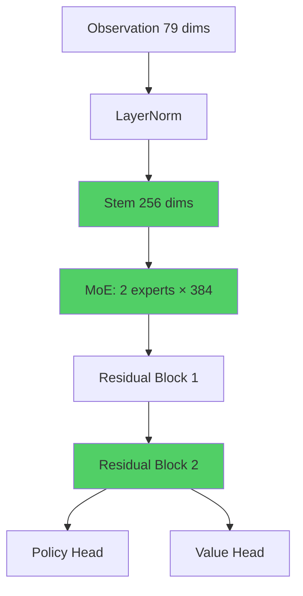
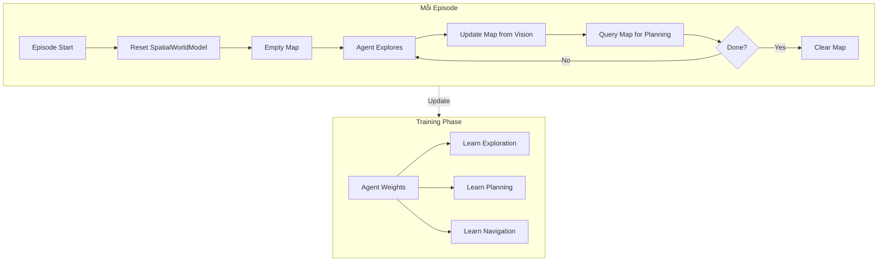
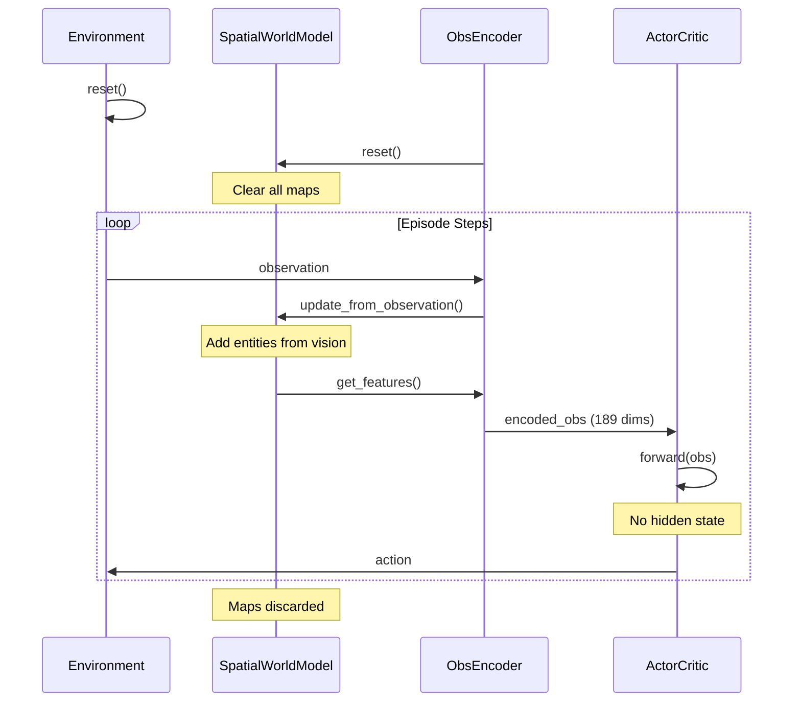

# Agent Memory Architecture

**Date:** 2026-03-01
**Status:** ✅ Production

---

## Overview

PPO agent với **feedforward architecture** + **external spatial world model**.

**Triết lý:**
- Agent học **meta-skills** (exploration, planning, navigation) trong weights
- **SpatialWorldModel** cung cấp episodic spatial memory (build runtime, reset mỗi episode)
- Environment cung cấp **short-term memory** qua `mem_*` features

---

## Network Architecture



**Specs:**
- **Hidden dim:** 256 (feedforward)
- **Expert hidden:** 384
- **Experts:** 2
- **Residual blocks:** 2 (dropout=0.15)
- **Total params:** ~1.15M
- **No recurrent layers** (feedforward only)

---

## Memory System



### 1. Environment Spatial Memory (Short-term)

**Location:** [environment.py:433-486](../state_sim/environment.py#L433-L486)

Tracks entities seen trong vision radius (0.30):
- Resources, gates, banks
- Decay after 300 ticks
- Provides `mem_resource_dx/dy`, `mem_gate_dx/dy`, `mem_bank_dx/dy`

### 2. SpatialWorldModel (Episodic)

**Location:** [spatial_world_model.py](../state_sim/spatial_world_model.py)

Build incrementally during episode:

```python
class SpatialWorldModel:
    zones: dict[str, ZoneModel]  # Per-zone maps

    def update_from_observation(obs, vision_radius):
        # Add seen entities to map

    def get_features(obs) -> dict:
        # Return 9 features for agent

    def reset():
        # Clear all maps (called each episode)
```

**Features provided (9 dims):**
- `wm_explored_ratio` - Fraction of zone explored
- `wm_known_resources` - Number of known resources / 12
- `wm_known_gates` - Number of known gates / 6
- `wm_exploration_target_dx/dy/dist` - Direction to unexplored area
- `wm_nearest_known_resource_dx/dy/dist` - Direction to known resource

---

## Observation Encoding

**Total:** 79 dimensions

```python
# Zone properties (generalizable — NO zone_id identity)
zone_type: 5 dims         # city, blue, yellow, red, black
biome: 5 dims             # forest, highland, mountain, steppe, swamp
zone_risk: 1 dim          # 0.0–1.0 continuous risk level
goal_zone_type: 5 dims    # goal zone type (property, not identity)
goal_biome: 5 dims        # goal zone biome
goal_risk: 1 dim          # goal zone risk level
task_type: 3 dims         # navigation, gather, mixed
fsm_state: 8 dims         # explore, approach_gate, gather, etc.

# Continuous (37 base + 9 world model)
x, y                      # Position
hp, mounted, inventory_load, threat_score
resource_value, xp_value

# Vision (within 0.30 radius)
nearest_resource_dist, dx, dy
nearest_gate_dist, dx, dy
nearest_bank_dist, dx, dy
nearest_mob_dist, nearest_obstacle_dist

# Environment memory
mem_resource_dist, dx, dy
mem_gate_dist, dx, dy
mem_bank_dist, dx, dy

# Counts & meta
resource_count, mob_count, obstacle_count
goal_distance, navigation_enabled, step_count
exploration_ratio, stagnation_ticks, gather_progress

# World model features (9 dims)
wm_explored_ratio
wm_known_resources, wm_known_gates
wm_exploration_target_dx, dy, dist
wm_nearest_known_resource_dx, dy, dist
```

---

## Training Flow



**Key points:**
- World model reset mỗi episode
- Agent không nhớ specific maps từ training
- Agent học generalizable skills trong weights

---

## Code Structure

### Network ([state_sim/ppo/network.py](../state_sim/ppo/network.py))

```python
class ActorCritic(nn.Module):
    def __init__(self, obs_dim, action_dim, memory_size=128):
        hidden_dim = 256
        expert_hidden = 384

        self.stem = nn.Sequential(...)
        self.experts = nn.ModuleList([Expert(...) for _ in range(2)])
        self.post_expert = nn.Sequential(
            ResidualBlock(256, dropout=0.15),
            ResidualBlock(256, dropout=0.15),
        )
        self.policy_tower = nn.Sequential(...)
        self.value_tower = nn.Sequential(...)

    def forward(self, x, hidden=None):
        # Feedforward only, hidden ignored
        h = self.stem(self.input_norm(x))
        # MoE + residual blocks
        return policy_logits, value, None
```

### Encoder ([state_sim/ppo/encoder.py](../state_sim/ppo/encoder.py))

```python
class ObsEncoder:
    def __init__(self, env, use_world_model=True):
        self.world_model = SpatialWorldModel() if use_world_model else None
        self.obs_dim = base_dims + (9 if use_world_model else 0)

    def reset(self):
        if self.world_model:
            self.world_model.reset()

    def encode(self, obs):
        if self.world_model:
            self.world_model.update_from_observation(obs)
            wm_features = self.world_model.get_features(obs)
        # Concatenate all features
        return encoded_vector
```

### Training ([state_sim/ppo/trainer.py](../state_sim/ppo/trainer.py))

```python
for episode in range(episodes):
    obs = env.reset()
    obs_encoder.reset()  # Reset world model

    hidden = model.init_hidden(1, device)  # Returns None

    while not done:
        obs_vec = obs_encoder.encode(obs)
        logits, value, new_hidden = model(obs_vec, hidden)
        # new_hidden is None (feedforward)
        action = sample_action(logits)
        obs, reward, done, info = env.step(action)
```

---

## Performance

| Metric             | Value                               |
| ------------------ | ----------------------------------- |
| **Parameters**     | ~1.15M                              |
| **Training Speed** | Fast (no BPTT, ~40% faster than v1) |
| **Gradient Flow**  | Stable (no clipping needed)         |
| **Memory**         | Episodic (reset each episode)       |
| **Observation**    | 79 dims (no zone_id identity)       |

---

## Philosophy

**What the agent learns (in weights):**
- ✅ Exploration strategies
- ✅ Planning heuristics
- ✅ Navigation skills
- ✅ Resource gathering tactics

**What the agent doesn't learn:**
- ❌ Specific map layouts
- ❌ Exact entity positions from training
- ❌ Hardcoded routes

**What SpatialWorldModel provides:**
- 🗺️ Runtime map building
- 🗺️ Episodic spatial awareness
- 🗺️ Exploration tracking
- 🗺️ Known entity positions

**Result:** Agent generalizes to new maps by using learned skills + building new spatial model each episode.

---

## Files

- [state_sim/ppo/network.py](../state_sim/ppo/network.py) - Feedforward ActorCritic
- [state_sim/ppo/encoder.py](../state_sim/ppo/encoder.py) - Observation encoding + WM
- [state_sim/spatial_world_model.py](../state_sim/spatial_world_model.py) - Episodic spatial memory
- [state_sim/ppo/trainer.py](../state_sim/ppo/trainer.py) - Training loop
- [state_sim/environment.py](../state_sim/environment.py#L433-L486) - Environment spatial_memory
